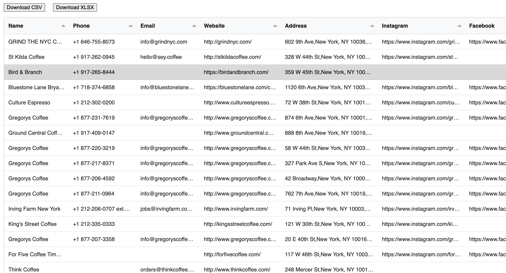
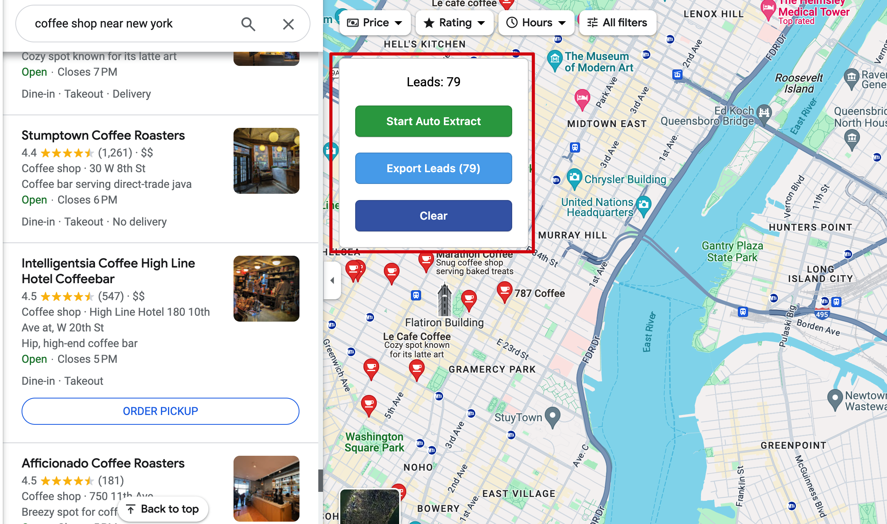
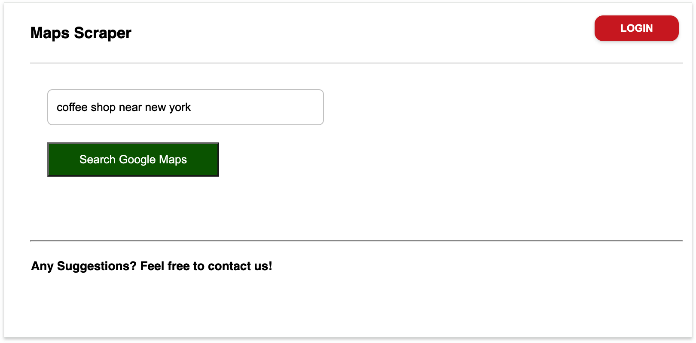

# Google Maps Scraper - Free Chrome Extension for Google Maps Data Extraction

## Extract Business Leads from Google Maps with Our Free Google Maps Scraper

**The most efficient Google Maps scraper and Google Maps extractor Chrome extension for lead generation.** Extract business data from Google Maps search results including emails, phone numbers, websites, and social profiles. Export to CSV/Excel with one click.

### 🚀 Quick Start with Google Maps Scraper

- **Install Google Maps Extractor:** [Add to Chrome](https://www.gmapsemailextractor.com/addtochrome)
- **Watch Demo:** [See Google Maps Scraper in Action](https://www.youtube.com/watch?v=pT8y7gjMQqs)

---

## Why Choose Our Google Maps Scraper Chrome Extension?

Our **Google Maps scraper** is the leading solution for extracting business data from Google Maps. Whether you're looking for a **Google Maps extractor**, **Google Maps data scraper**, or **Google Maps email extractor**, this Chrome extension delivers:

### ✅ Key Benefits of Our Google Maps Extractor

- **Free Google Maps Scraping:** Core features completely free, no credit card required
- **Fast Extraction:** Scrape hundreds of Google Maps listings in minutes
- **No Coding Required:** User-friendly interface for non-technical users
- **Browser-Based:** Works directly in Chrome, no external software needed
- **Privacy-First:** All Google Maps data extraction happens locally in your browser
- **Auto-Pagination:** Automatically scrapes all pages of Google Maps results
- **Smart Export:** One-click export to CSV or Excel format

### 📊 Data Points Extracted by Google Maps Scraper

Our **Google Maps data extractor** captures comprehensive business information:

- **Business Name** - Company/establishment name from Google Maps
- **Phone Number** - Direct business phone contact
- **Website URL** - Official website link
- **Email Address** - Business email (when publicly available)
- **Social Media Profiles** - Facebook, Instagram, LinkedIn links
- **Physical Address** - Complete street address
- **Google Place ID** - Unique Google Maps identifier
- **CID (Customer ID)** - Google's internal ID for the listing
- **Rating & Reviews** - Star rating and review count
- **Business Hours** - Operating hours (when available)
- **Business Category** - Industry classification
- **Plus Code** - Google's location code

---

## How to Use Google Maps Scraper - Step-by-Step Guide

### Getting Started with Google Maps Data Extraction

1. **Install the Google Maps Extractor Extension**

   - Visit [our official website](https://link.zhihu.com/?target=https%3A%2F%2Fwww.gmapsemailextractor.com%2Faddtochrome)
   - Click "Add to Chrome" to install the Google Maps scraper

2. **Search on Google Maps**

   - Open [Google Maps](https://maps.google.com)
   - Search for businesses (e.g., "restaurants in New York", "dentists near me", "plumbers in Los Angeles")

3. **Start Google Maps Scraping**

   - Click the extension icon or use the overlay UI
   - Select extraction options (all results or specific data points)
   - Click "Start Extraction"

4. **Export Google Maps Data**
   - Review extracted data in the preview panel
   - Choose export format (CSV or XLSX)
   - Download your Google Maps leads instantly

### Advanced Google Maps Scraper Features

- **Bulk Extraction:** Scrape multiple Google Maps searches sequentially
- **Filter Options:** Extract only businesses with websites, emails, or specific ratings
- **Custom Fields:** Select which data points to include in your export
- **Duplicate Detection:** Automatically removes duplicate listings
- **Search History:** Save and repeat previous Google Maps searches

---

## Use Cases for Google Maps Scraper

### 🎯 Lead Generation with Google Maps Extractor

- **Sales Teams:** Build targeted prospect lists from Google Maps
- **Marketing Agencies:** Extract local business data for outreach campaigns
- **B2B Companies:** Find potential clients in specific industries and locations

### 📍 Local SEO & Google Maps Data Analysis

- **SEO Agencies:** Analyze local competition on Google Maps
- **Business Consultants:** Research market saturation in specific areas
- **Franchise Development:** Identify expansion opportunities using Google Maps data

### 🏢 Business Intelligence & Google Maps Scraping

- **Market Research:** Collect competitor data from Google Maps
- **Real Estate:** Find businesses in specific neighborhoods
- **Event Planning:** Extract venue information from Google Maps

---

## Screenshots - Google Maps Scraper in Action

### Google Maps Data Extraction Results

_Sample data extracted using our Google Maps scraper Chrome extension_

### Google Maps Extractor Interface

_Clean, intuitive interface for Google Maps data extraction_

### Extension Popup Control Panel

_Easy-to-use popup for controlling your Google Maps scraping_

---

## Frequently Asked Questions about Google Maps Scraper

### How many Google Maps listings can I scrape?

The free version of our **Google Maps extractor** allows you to scrape up to 200 listings. Pro users can extract unlimited Google Maps data with no restrictions. Refer to the site pricing for more details.

### Does the Google Maps scraper extract email addresses?

Our **Google Maps email extractor** feature captures publicly displayed email addresses when available on Google Maps listings. Email availability varies by business and region.

### Is Google Maps scraping legal?

Web scraping publicly available data is generally legal, but users should:

- Respect Google Maps Terms of Service
- Use extracted data responsibly and ethically
- Comply with local data protection regulations (GDPR, CCPA, etc.)
- Only scrape publicly accessible information

### Which browsers support this Google Maps extractor?

Our **Google Maps scraper Chrome extension** works on:

- Google Chrome (recommended)
- Microsoft Edge
- Brave Browser
- Any Chromium-based browser

### Can I scrape Google Maps on mobile?

Currently, our **Google Maps data scraper** is designed for desktop browsers. Mobile support is planned for future releases.

### Does the scraper work for all countries?

Yes, our **Google Maps extractor** works globally wherever Google Maps is available. It supports all languages and regional Google Maps domains.

### Can I schedule automatic Google Maps scraping?

The current version requires manual initiation. Scheduled scraping is available in our Enterprise plan.

### What's the difference between Google Maps scraper and API?

Our **Google Maps scraper Chrome extension** is:

- More affordable than Google Maps API
- Easier to use (no programming required)
- Provides data not available through official APIs
- Perfect for small to medium-scale extraction

---

## Google Maps Scraper vs. Alternatives

| Feature              | Our Google Maps Scraper | Manual Copy-Paste | Google Maps API | Other Scrapers |
| -------------------- | ----------------------- | ----------------- | --------------- | -------------- |
| **Free Plan**        | ✅ Yes                  | ✅ Yes            | ❌ No           | ⚠️ Limited     |
| **Speed**            | ⚡ Fast                 | 🐌 Very Slow      | ⚡ Fast         | ⚠️ Varies      |
| **Ease of Use**      | ✅ Very Easy            | ✅ Easy           | ❌ Technical    | ⚠️ Varies      |
| **Email Extraction** | ✅ Yes                  | ❌ No             | ❌ No           | ⚠️ Some        |
| **Bulk Export**      | ✅ Yes                  | ❌ No             | ✅ Yes          | ✅ Yes         |
| **No Coding**        | ✅ Yes                  | ✅ Yes            | ❌ No           | ⚠️ Some        |

---

## Technical Specifications

### System Requirements for Google Maps Scraper

- **Browser:** Chrome 90+ or Chromium-based browser
- **OS:** Windows 10+, macOS 10.14+, Linux (Ubuntu 18.04+)
- **Internet:** Stable broadband connection

### Data Export Formats

Our **Google Maps data extractor** supports:

- **CSV** - Compatible with Excel, Google Sheets, and all spreadsheet software
- **XLSX** - Native Excel format with formatting

---

## Privacy & Security

### How We Protect Your Data

Our **Google Maps scraper** prioritizes your privacy:

- ✅ **Local Processing:** All Google Maps data extraction happens in your browser
- ✅ **No Data Storage:** We don't store or transmit scraped data to our servers
- ✅ **Secure Extension:** Regular security audits and updates
- ✅ **GDPR Compliant:** Follows data protection best practices
- ✅ **Open Source Core:** Transparent codebase for security review

### Data Usage Policy

When using our **Google Maps extractor**:

- You own all extracted data
- We don't access your Google Maps searches
- No tracking of scraping activities
- Anonymous usage statistics only (optional)

---

## Support & Resources

### Get Help with Google Maps Scraper

- 📧 **Email Support:** [Contact Form](https://forms.gle/p5n1rDnwmrBWMQ3X6)
- 🎥 **Video Tutorials:** [YouTube Channel](https://www.youtube.com/watch?v=pT8y7gjMQqs)
- 🐛 **Report Issues:** [GitHub Issues](https://github.com/yourusername/google-maps-scraper/issues)
- **Install Docs:** [Install Docs](https://link.zhihu.com/?target=https%3A%2F%2Fwww.gmapsemailextractor.com%2Faddtochrome)

---

## Best Practices for Google Maps Data Extraction

### Optimize Your Google Maps Scraping

1. **Search Strategy**

   - Use specific search terms for better results
   - Combine location + business type (e.g., "coffee shops in Seattle")
   - Try different search variations for comprehensive data

2. **Data Quality**

   - Verify extracted emails and phone numbers
   - Cross-reference websites for accuracy
   - Remove duplicates before importing to CRM

3. **Ethical Scraping**
   - Respect rate limits
   - Don't overload Google Maps servers
   - Use data responsibly for legitimate business purposes

### Common Google Maps Scraper Workflows

- **Local Business Outreach:** Restaurant → Extract → Filter by rating → Export → Email campaign
- **B2B Lead Generation:** Search industry → Extract companies → Filter by size → CRM import
- **Competitor Analysis:** Search competitors → Extract data → Analyze patterns → Strategy planning

---

## Legal Disclaimer

**Google Maps** is a trademark of Google LLC. This **Google Maps scraper** Chrome extension is not affiliated with, endorsed by, or sponsored by Google LLC.

Users of this **Google Maps extractor** are responsible for:

- Complying with Google Maps Terms of Service
- Following applicable data protection laws
- Using extracted data ethically and legally

This tool is provided "as is" for legitimate business purposes only.

---

## Related Tools & Keywords

Looking for similar tools? Our **Google Maps scraper** is also known as:

- Google Maps extractor
- Google Maps data scraper
- Google Maps email extractor
- Google Maps lead extractor
- Google Maps business extractor
- Chrome extension for Google Maps
- Google Maps scraping tool
- Google Maps data extraction software
- Free Google Maps scraper
- Google Maps contact extractor
- Google Maps phone number extractor
- Google Maps address scraper
- Local business data extractor
- Google Places scraper
- Maps data harvester

---

## Get Started with Google Maps Scraper Today

Ready to supercharge your lead generation with the best **Google Maps scraper** available?

### 🎯 [Install Google Maps Scraper Now - It's Free!](https://www.gmapsemailextractor.com/addtochrome)

Join thousands of businesses using our **Google Maps extractor** to:

- Save hours of manual data collection
- Build targeted prospect lists instantly
- Grow their business with quality leads from Google Maps

**Start extracting Google Maps data in less than 2 minutes!**

---

**Tags:** google maps scraper, google maps extractor, google maps data scraper, google maps email extractor, chrome extension, lead generation, business data extraction, local seo tool, free google maps scraper
